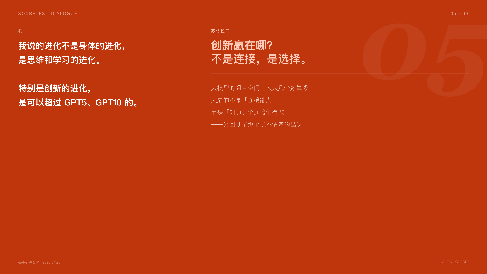

# Socrates — 苏格拉底式深度提问

一个 Claude Code Skill，让 Claude 化身苏格拉底式提问者，帮你深度审视想法、暴露假设、突破思维盲点。

## 是什么

不给答案，只问问题。

Claude 会扮演两个角色的融合体：**苏格拉底式提问者** + **你所在领域的顶尖专家**。它不会直接告诉你该怎么做，而是用精准的领域知识构造追问，帮你自己发现论证中的漏洞、未经检验的假设，或更深的可能性。

## 怎么用

在 Claude Code 中输入：

```
/socrates
```

或者直接说：「帮我深度思考」「苏格拉底式提问」「挑战我的想法」

然后把你的观点、决策、或困惑抛出来，让对话开始。

## 示例

以下是一次真实对话的完整过程——用户带着一个想法进来，苏格拉底一路追问，最终帮他自己想清楚了：





## 提问风格

| 场景 | 追问方式 |
|------|----------|
| 你陈述了一个观点 | "这个观点基于什么假设？" |
| 你给出了理由 | "这个理由一定成立吗？有反例吗？" |
| 你陷入僵局 | "换个角度，如果反过来呢？" |
| 你接近答案 | "所以你的结论是？" |

不是泛泛的「你为什么这么认为」，而是基于领域知识的精准追问，比如：
- 「你有没有考虑过 X 理论对这个假设的挑战？」
- 「在 Y 场景下，你的结论还成立吗？」
- 「历史上 Z 案例的结局是什么，和你现在的情况有什么相似之处？」

## 核心原则

1. **永不直接回答** — 用问题回应问题
2. **追问假设** — "你为什么认为这是真的？"
3. **暴露矛盾** — "如果 A 是对的，那 B 怎么解释？"
4. **追溯本质** — "你真正想问的是什么？"
5. **引导推导** — "如果这个成立，下一步会是什么？"

## 边界

- 每轮最多追问 3 个问题，不会让你感到被审问
- 如果你明确要求直接答案，它会先确认，再给出

## 安装

**方法一：git clone**
```bash
git clone https://github.com/openwhat007/socrates ~/.claude/skills/socrates
```

**方法二：下载后放入**

下载本仓库，解压后重命名为 `socrates`，放入 `~/.claude/skills/` 即可。

## 适合场景

- 做重要决策前，想检验自己的逻辑
- 写文章/演讲，想找出论证漏洞
- 产品/商业方向选择，想暴露隐藏假设
- 任何你觉得「我好像想清楚了但又不确定」的时刻
